# Backup

---

<!-- slide: data-background-image="../assets/img/profile/erin-devoxx-2022-tall.jpg" class="fade-max left" -->
### A bit about me...

- Developer of things at Red Hat
- IBMer for 21 years
- Java Champion
- Distinguished Engineer
- Builder of *ridiculous* things

---

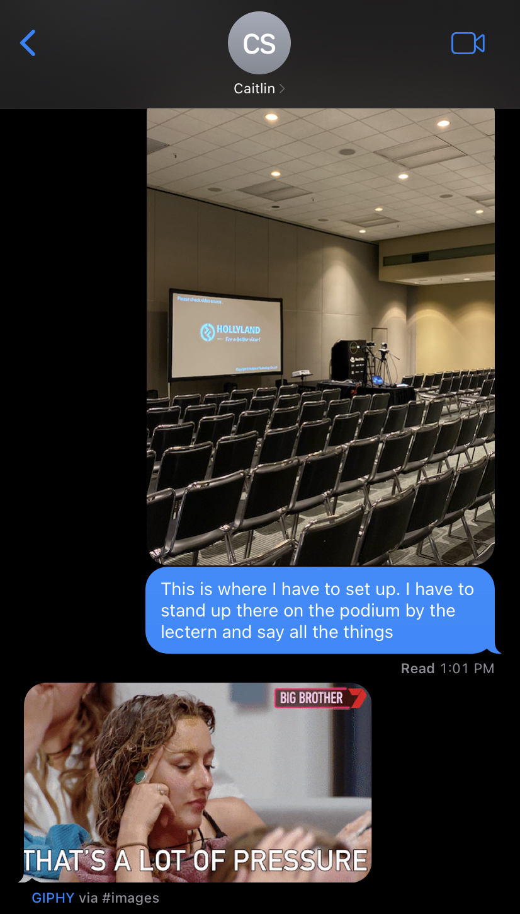

---
<!-- .slide: class="no-title" -->
### We're still talking about microservices?

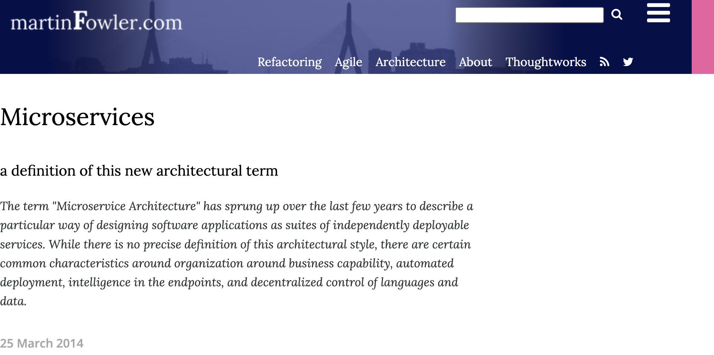

https://www.martinfowler.com/articles/microservices.html<!-- element class="attribution bottom" -->

---
<!-- .slide: class="no-title" -->
### Monolithic vs. Microservices.. ?

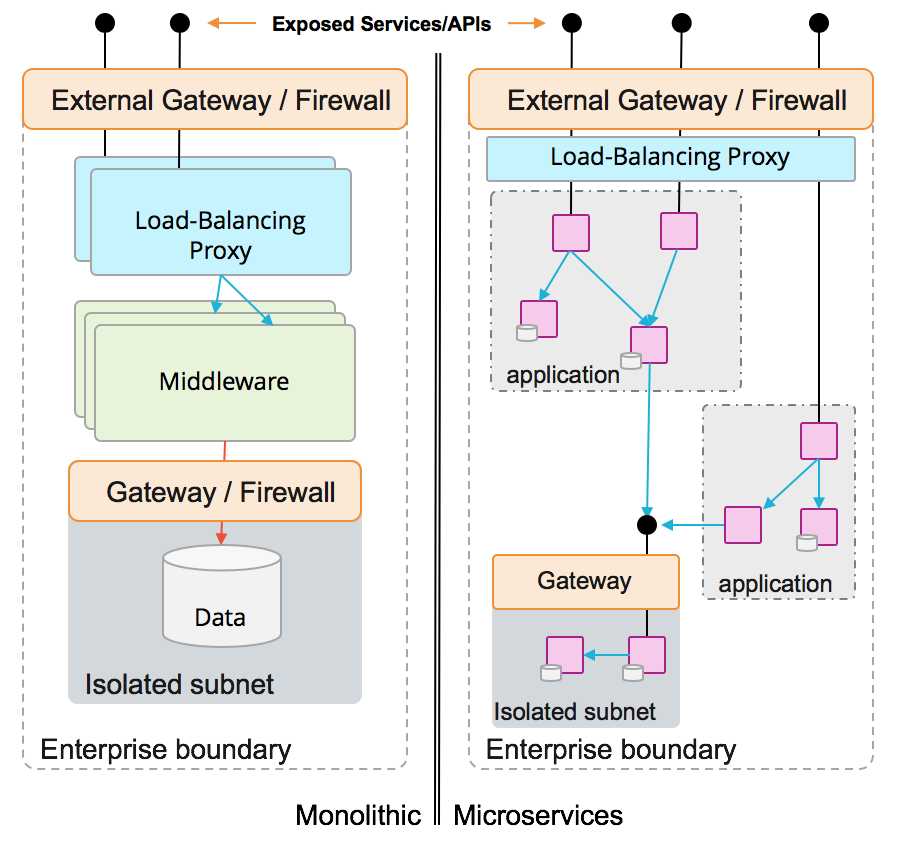

---
<!-- .slide: class="no-title" -->
### Evolution of a system...

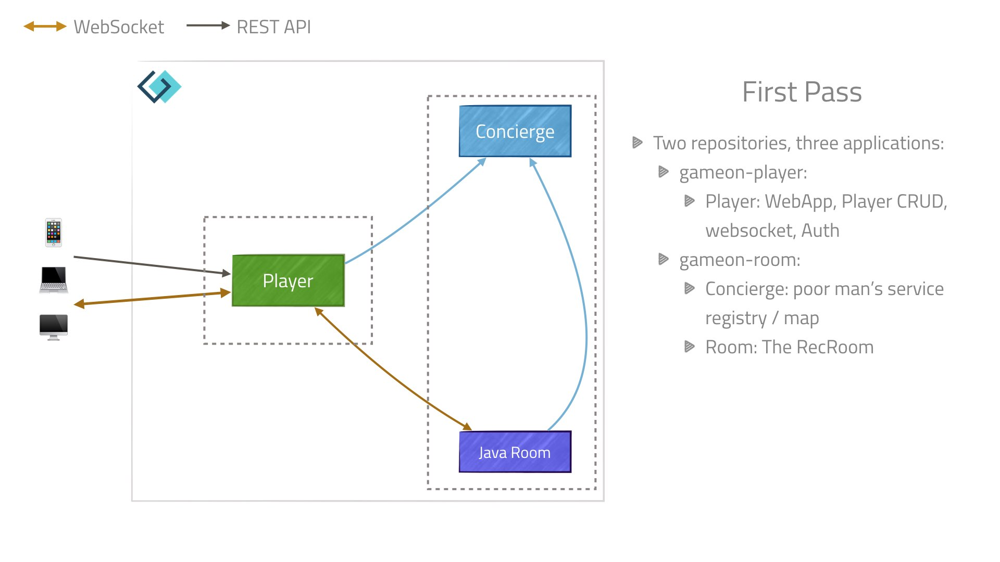 <!-- element class="center fragment" -->
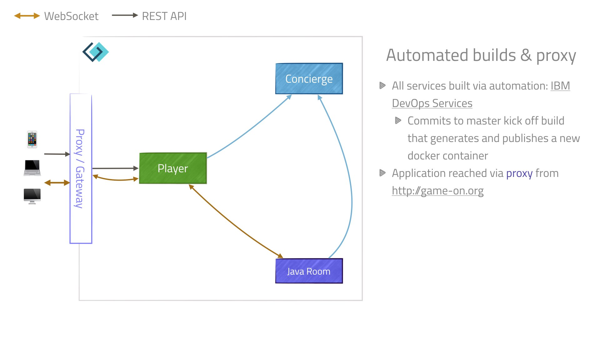<!-- element class="center fragment fade-in" -->
<!-- element class="center fragment fade-in" -->
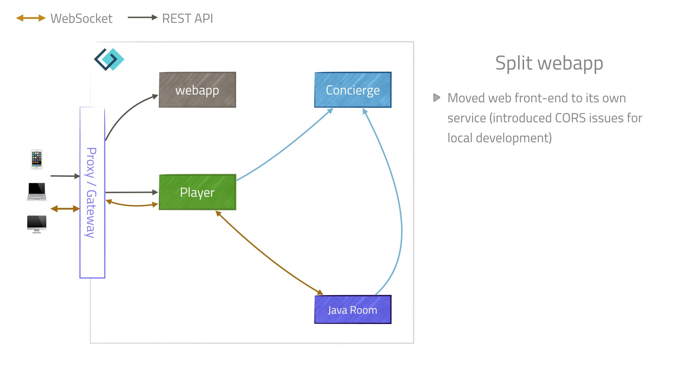<!-- element class="center fragment fade-in" -->
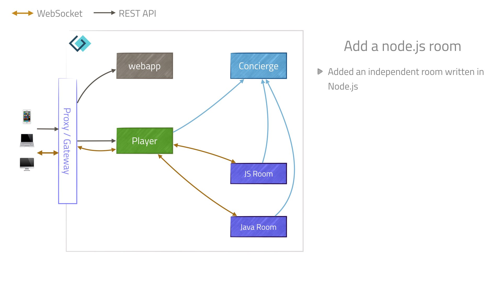<!-- element class="center fragment fade-in" -->
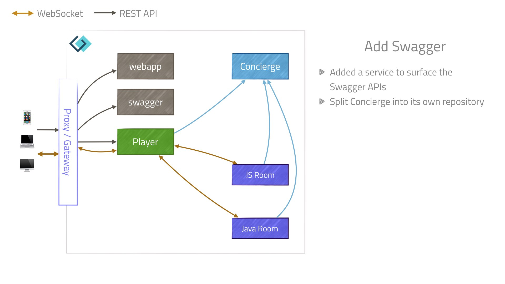<!-- element class="center fragment fade-in" -->
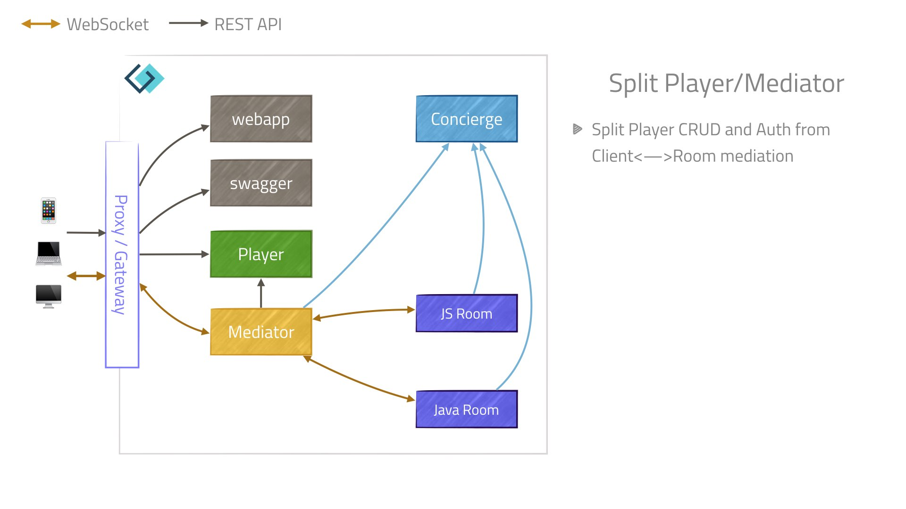<!-- element class="center fragment fade-in" -->
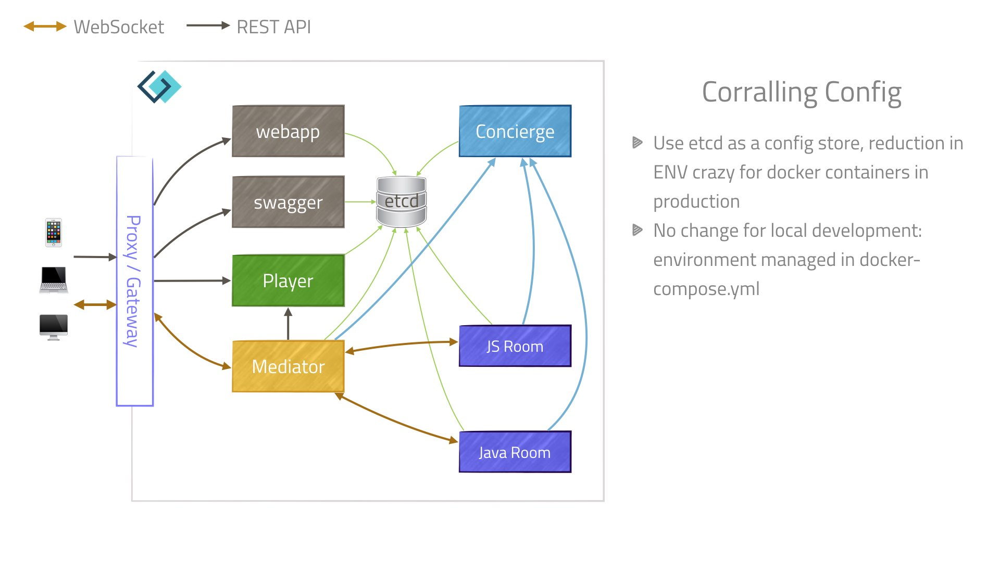<!-- element class="center fragment fade-in" -->
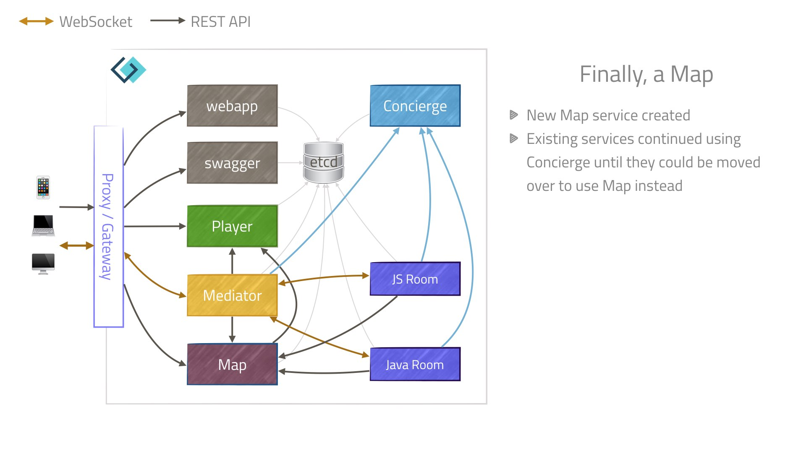<!-- element class="center fragment fade-in" -->
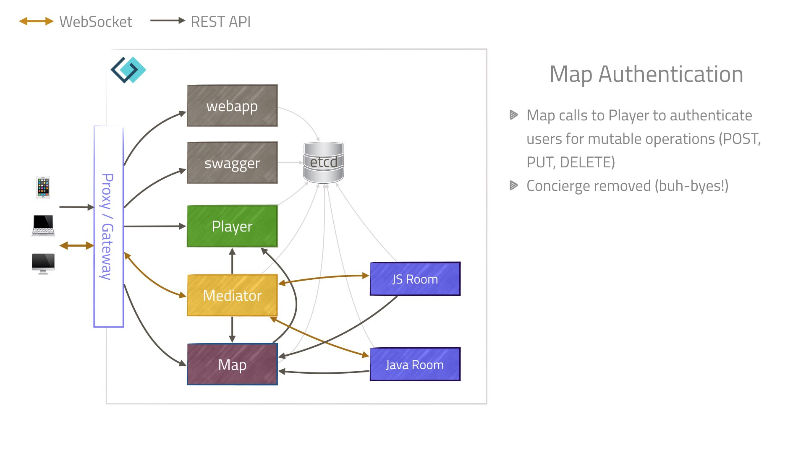<!-- element class="center fragment fade-in" -->
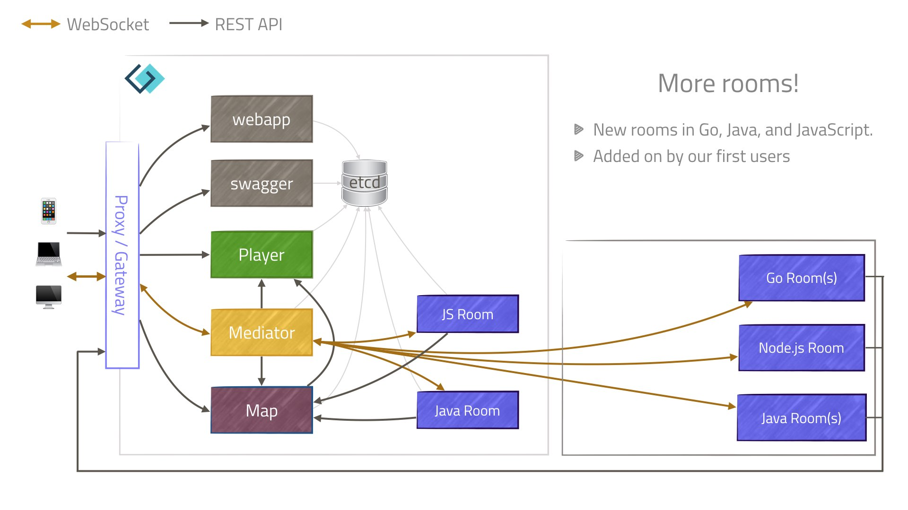<!-- element class="center fragment fade-in" -->
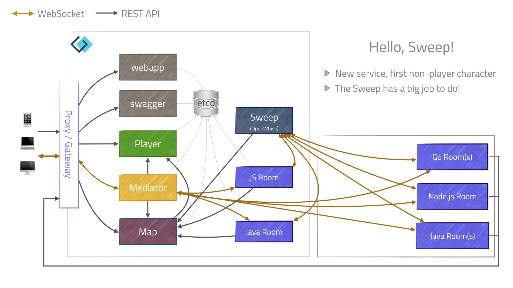<!-- element class="center fragment fade-in" -->
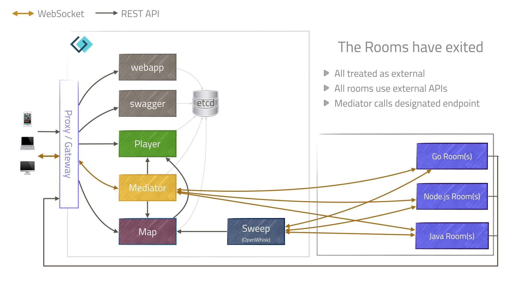<!-- element class="center fragment fade-in" -->
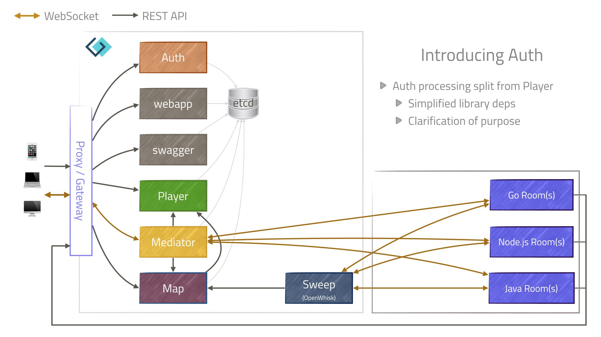<!-- element class="center fragment fade-in" -->
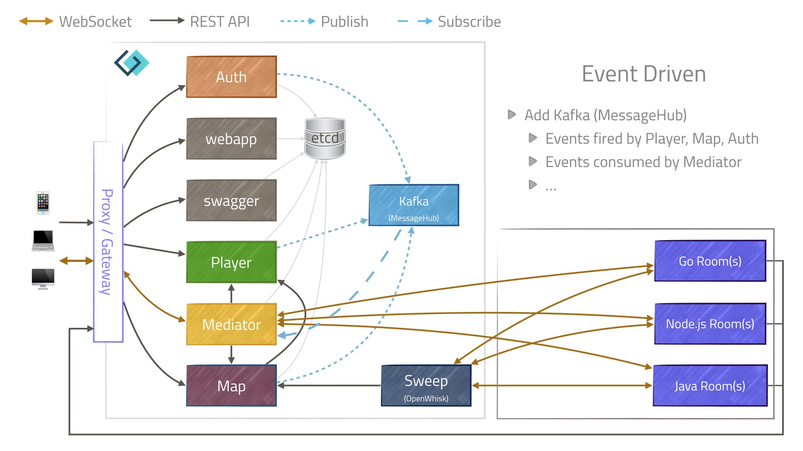<!-- element class="center fragment fade-in" -->
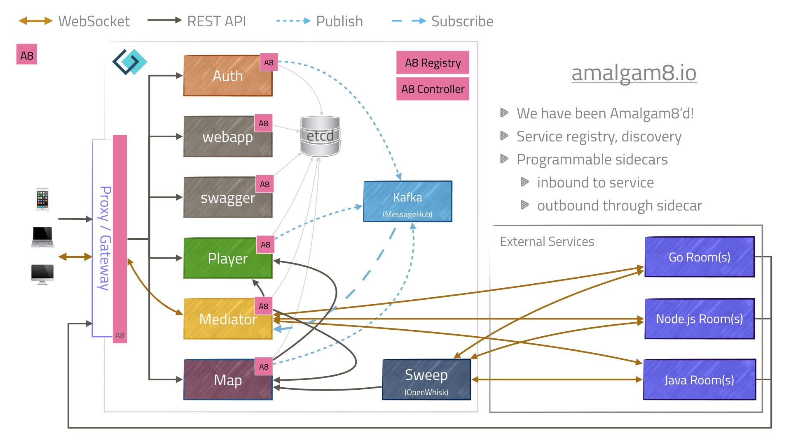<!-- element class="center fragment fade-in" -->

---

