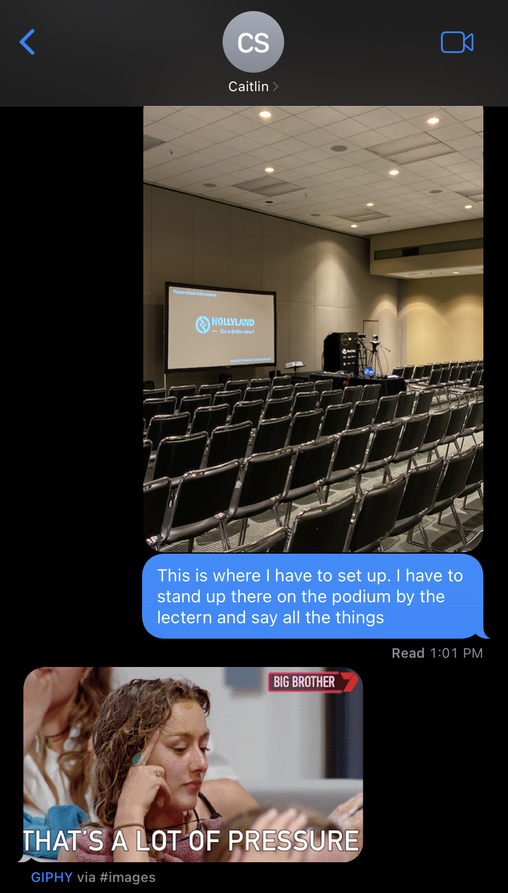
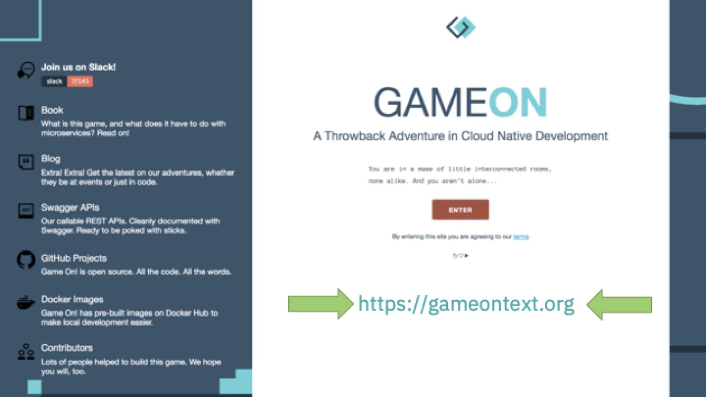
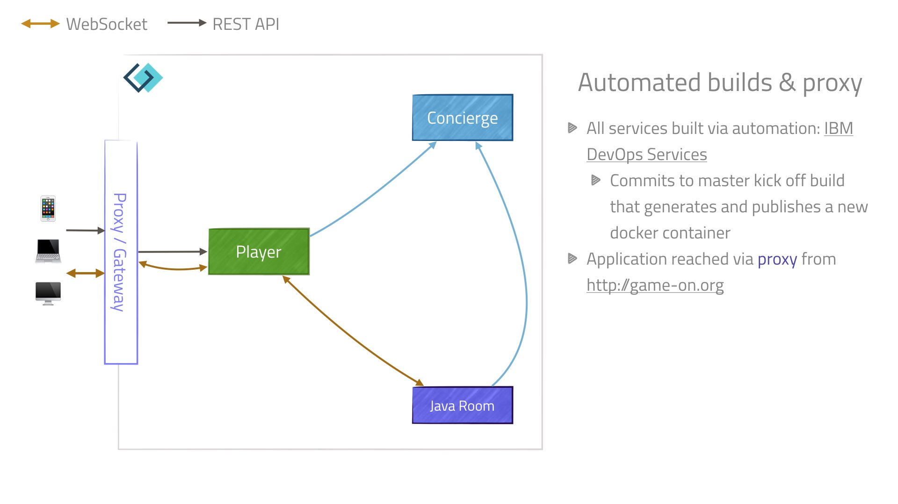
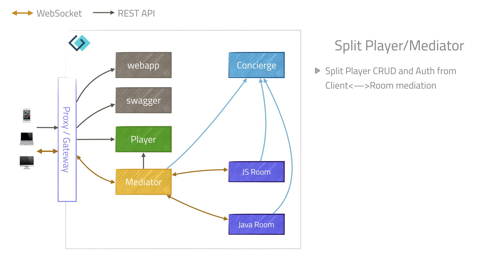
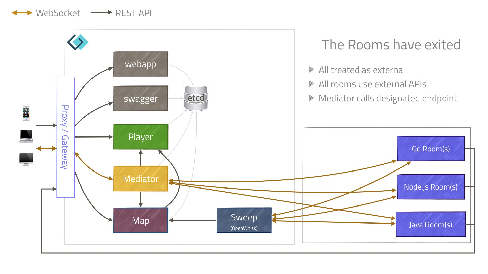
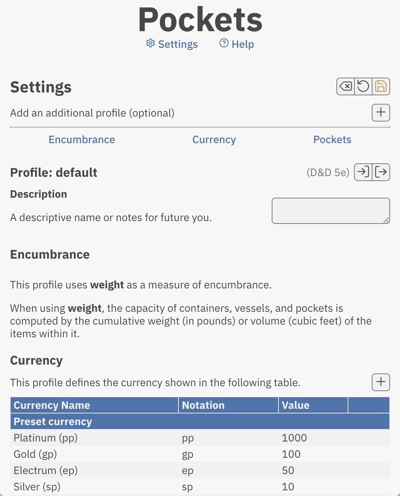
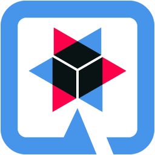

%%The flow of information and events through distributed systems goes well beyond HTTP, REST, and JSON. 

In this talk, we’ll use Apache Camel to explore integration patterns that add flexibility and resilience to your evolving architecture.%%


## Beyond REST and CRUD
%% %%
### Integration patterns in Microservices

::: block
 
:::<!-- element style="margin-top: 10%" -->

<span>Erin Schnabel, Red Hat<br />[github.com/ebullient](https://github.com/ebullient) ・ [www.ebullient.dev](https://www.ebullient.dev/)</span><!-- element class="footer" -->

---

<!-- slide: data-background-image="../assets/img/profile/erin-devoxx-2022-tall.jpg" class="fade-max left" -->
### A bit about me...

- Developer of things at Red Hat
- IBMer for 21 years
- Java Champion
- Distinguished Engineer
- Builder of *ridiculous* things

---



---
<!-- .slide: class="no-title" -->
### We're still talking about microservices?


https://www.martinfowler.com/articles/microservices.html<!-- element class="attribution bottom" -->

---
<!-- .slide: class="no-title" -->
### Monolithic vs. Microservices.. ?


---

<grid drag="50 100" drop="left">
### Essential factors 
Autonomous  
Portable  
Disposable  
<span>*Independent*</span><!-- element class="fragment" -->
</grid>

<grid drag="50 100" drop="right">

</grid>

---
<!-- .slide: class="no-title" -->
### Evolution of a system...

 <!-- element class="center fragment" -->
<!-- element class="center fragment fade-in" -->
<!-- element class="center fragment fade-in" -->
<!-- element class="center fragment fade-in" -->
<!-- element class="center fragment fade-in" -->
<!-- element class="center fragment fade-in" -->
<!-- element class="center fragment fade-in" -->
<!-- element class="center fragment fade-in" -->
<!-- element class="center fragment fade-in" -->
<!-- element class="center fragment fade-in" -->
<!-- element class="center fragment fade-in" -->
<!-- element class="center fragment fade-in" -->
<!-- element class="center fragment fade-in" -->
<!-- element class="center fragment fade-in" -->
<!-- element class="center fragment fade-in" -->
<!-- element class="center fragment fade-in" -->

---

### How do we adapt?

- Applications must  evolve
- Rarely ever a clean slate <!--element class="fragment fade-in" -->
- Decouple elements of the system <!--element class="fragment fade-in" -->

---

### Systems Integration

Different perspective  
<span>*Message Routing*</span><!-- element class="fragment" -->

notes: Writing glue and focusing on the space between

---

<grid drag="50 100" drop="right">
### *Enterprise* patterns
Emergent  
"Design patterns" 
Best practices  
</grid>

<grid drag="50 100" drop="left">

</grid>

---
<!-- .slide: data-auto-animate -->

<grid drag="100 100" drop="-3">
<!-- element  class="fade no-margin" -->
</grid>

<grid drag="50 100" drop="22" >
### Apache Camel

- Integration framework
- Anything to anything
- Fit for purpose:   
  ... use what you need
</grid>

---
<!-- .slide: data-auto-animate class="no-title" -->
### CAMEL is an acronym

<grid drag="100 100" drop="-3">
<!-- element  class="fade no-margin" -->
</grid>

<grid drag="50 100" drop="30" align="left" pad="0" class="acrostic monospace">
- Concise  
- Application  
- Messaging  
- Exchange  
- Language  
</grid>

---
<!-- .slide: class="definition-list top-title" -->
### Camel message routing... 

| Term | Meaning |
|------|---------|
|`Message`  | *data* transferred by a route |
|`Exchange` | *envelope*; wraps the data |
|`Endpoint` | a channel; *receiver* or *sender* |
|`Component`| know-how; creates endpoints |
|`Processor`| Java API; *custom logic* | 

---

<grid drag="55 100" drop="left" class="small-text">
### Pockets
- Inventory management
- Command-line
- local-only Web UI
</grid>

<grid drag="80 100" drop="50 0">

</grid>

---
<!-- .slide: class="top-title" -->
### Pockets: The plan

<grid frag="0" class="current-visible" drag="70 70" drop="center" style="z-index: 1">

</grid>

<grid frag="1" class="fade-out" drag="25 40" drop="2 12" bg="white" style="z-index: 0"/>%% pocket ui %% 
 
<grid frag="1" class="current-visible" drag="70 70" drop="center" style="z-index: 1" class=" current-visible"> 

</grid>

<grid frag="2" class="fade-out" drag="22 20" drop="4 68"  bg="white" style="z-index: 0" />%% pocket terminal %%

<grid frag="2" class="fade-out" drag="40 50" drop="40 30"  bg="white" style="z-index: 0" />%% pocket data %%

<grid frag="3" class="fade-out" drag="20 21" drop="27 23"  bg="white" style="z-index: 0" />%% web-ui-to-data %%

<grid frag="3" class="fade-out" drag="23 21" drop="26 62"  bg="white" style="z-index: 0" />%% cli-to-data %%

<grid frag="4" class="fade-out" drag="20 10" drop="26 45" rotate="18"  bg="white" style="z-index: 0" />%% data-to-web-ui %%

<grid frag="4" class="fade-out" drag="25 10" drop="22 53" rotate="331"  bg="white" style="z-index: 0" />%% data-to-cli %%

<grid frag="5" class="fade-out" drag="14 12" drop="67 38" rotate="0"  bg="white" style="z-index: 0" />%% data-to-jlog%%

<grid frag="5" class="fade-out" drag="16 16" drop="70 22" rotate="0"  bg="white" style="z-index: 0" />%% jlog%%

<grid frag="6" class="fade-out" drag="13 15" drop="67 53" rotate="0"  bg="white" style="z-index: 0" />%% data-to-md %%

<grid frag="6" class="fade-out" drag="16 16" drop="70 68" rotate="0"  bg="white" style="z-index: 0" />%% md%%

<grid frag="7" class="fade-out" drag="16 4" drop="67 49" rotate="0"  bg="white" style="z-index: 0" />%% data-to-whatever %%

<grid frag="7" class="fade-out" drag="16 16" drop="82 42" rotate="0"  bg="white" style="z-index: 0" />%% whatever%%

<grid drag="100 100" drop="center" style="z-index: -2">

</grid>

---
<!-- .slide: data-auto-animate class="top-title" -->

### REST and REST... 
::: block
```java
@Path("/pockets")
public class TheoreticalPockets {
    @GET
    public Response getProfiles() {
       // fetch some stuff
    }
    
    @GET
    @Path("{profile}")
    public Response getProfile(@PathParam("profile") String id) {
       // fetch specific stuff
    }
    
    @POST
    @Path("{profile}")
    public Response updateProfile(@PathParam("profile") String id, ...) {
        // do important things
    }
}
```
:::<!-- element class="raw-code code-small full-size" -->

---
<!-- .slide: data-auto-animate  class="top-title" -->

### REST and REST... 

<grid drag="90 60" drop="14 24">
<!-- element class="full-size" -->
</grid>

::: block
REST *component* adds support for REST semantics, including a DSL.
:::<!-- element class="footer small-text bottom" -->

---
<!-- .slide: class="top-title" -->
### Flow of data with Camel Route: REST

<grid drag="100 30" drop="0 12" style="z-index: -2">

</grid>

<grid frag="0" class="fade-out" drag="100 30" drop="0 12" style="z-index: 0">

</grid>

<grid frag="0" class="fade-out" drag="100 40" drop="5 40" bg="white" style="z-index: 0">
::: block
```java [1,8-9]
	rest("/pockets")
			.get()
			.to("direct:getProfiles")

			.get("/{profile}")
			.to("direct:getProfile")

			.post("/{profile}")
			.to("direct:validateAndModifyPockets"); // <--- HERE
```
:::<!-- element class="raw-code full-size"  -->
</grid>


<grid drag="80 65" drop="12 36"  style="z-index: -3" >
<!-- element class="full-size" -->
</grid>

<grid frag="1" class="fade-out" drag="12 20" drop="18 14" bg="white" style="z-index: -1" />%% debug-pipe-1 %%
<grid frag="1" class="fade-out" drag="10 20" drop="70 14" bg="white" style="z-index: -1" />%% debug-pipe-2 %%
<grid frag="1" class="fade-out" drag="96 8" drop="2 60" bg="white" style="z-index: -1" />%% debug-1%%
<grid frag="1" class="fade-out" drag="96 12" drop="2 88" bg="white" style="z-index: -1" />%% debug-2 %%

<grid frag="2" class="fade-out" drag="12 20" drop="29 14" bg="white" style="z-index: -1" />%% validate-pipe %%
<grid frag="2" class="fade-out" drag="96 7" drop="2 68" bg="white" style="z-index: -1" />%% validate-profile%% 

<grid frag="3" class="fade-in-then-out" drag="100 60" drop="0 40" bg="white" style="z-index: 0">
::: block
```java [1-2,5-6,9,11]
    @Transactional
    public void validateProfile(Exchange exchange) {
        final String profileKey = "profile";

        Message message = exchange.getMessage();
        String profile = (String) message.getHeader(profileKey);

        // Update header with full name, may throw
        profile = ProfileContext.validateProfile(profile);

        message.setHeader(profileKey, profile);
    }
```
:::<!-- element class="raw-code full-size"  -->
</grid>

<grid frag="4" class="fade-out" drag="20 26" drop="40 14" bg="white" style="z-index: -1" />%% call-bean-pipe %%

<grid frag="4" class="fade-out" drag="96 7" drop="2 75" bg="white" style="z-index: -1" />%% do modification %%

<grid frag="5" class="fade-in-then-out" drag="100 60" drop="5 40" bg="white" style="z-index: 0">
::: block
```java [1,5-8,10,12]
.bean(webRouteHandler, "doModification(${body}, ${header.profile})")

~~~~~~

    @Transactional
    public ModificationResponse doModification(
		    ModificationRequest modificationRequest, 
		    String profileName) {
		    
        profileContext.setActiveProfile(profileName);
        
        return modifyPockets.modifyPockets(modificationRequest);
    }
```
:::<!-- element class="raw-code full-size"  -->
</grid>

<grid frag="6" class="fade-out" drag="10 20" drop="60 14" bg="white" style="z-index: -1" />%% wire-tap-pipe %%

<grid frag="6" class="fade-out" drag="96 7" drop="2 82" bg="white" style="z-index: -1" />%% wire tap %%

---
<!-- .slide: data-auto-animate  class="top-title" -->
### Flow of data with Camel Route: CLI %% 1 %%

<grid drag="10 10" drop="-2 -6" style="z-index: 0">

</grid>
<grid drag="10 10" drop="-12 -6" style="z-index: 0">

</grid>

<grid drag="100 40" drop="0 35" bg="white" style="z-index: 0">
::: block
```java [2-3,7-8,13,19]
@Override
@ActivateRequestContext
@Transactional
public final Integer call() {
	try {
		// Validate specified profile
		String activeProfile = activeProfileMixin.findActiveProfileId();

		if (activeProfile == null) {
			return ExitCode.USAGE;
		}
		
		profileContext.setActiveProfile(activeProfile);
		if (showTypes) {
			showTypes();
			return ExitCode.OK;
		}

		return delegateCall(); //  delegate to sub-command
	} catch (...) {
		...
	}
}
```
:::<!-- element class="raw-code full-size"  -->
</grid>

---
<!-- .slide: data-auto-animate  class="top-title" -->
### Flow of data with Camel Route: CLI %% 2 %%

<grid drag="10 10" drop="-2 -6" style="z-index: 0">

</grid>
<grid drag="10 10" drop="-12 -6" style="z-index: 0">

</grid>

<grid drag="100 40" drop="0 35" bg="white" style="z-index: 0">
::: block
```java [2,4,6-7,11]
    @Override
    public Integer delegateCall() {
    
        Modification modification = createModification();
        
        ModificationRequest req = createModificationRequest(
		        "Create " + modification.itemDetails.name)
		                .add(modification);

        // Make the modification
        ModificationResponse response = modifyPocketRoute.modifyPockets(req);

        response.changes.stream().filter(c -> c.type == PostingType.CREATE)
                .forEach(c -> {
					...
                });

        return ExitCode.OK;
    }
```
:::<!-- element class="raw-code full-size"  -->
</grid>

---
<!-- .slide: data-auto-animate  class="top-title" -->
### Flow of data with Camel Route: CLI %% 3 %%

<grid drag="10 10" drop="-2 -6" style="z-index: 0">

</grid>
<grid drag="10 10" drop="-12 -6" style="z-index: 0">

</grid>

<grid drag="100 40" drop="0 35" bg="white" style="z-index: 0">
::: block
```java [1-2, 6-8,10-11]
// Make the modification
ModificationResponse response = modifyPocketRoute.modifyPockets(req);
        
~~~~

public interface CliModifyPocket {
	ModificationResponse modifyPockets(ModificationRequest request);
}

@Produce("direct:modifyPockets")
CliModifyPocket modifyPocketRoute;
```
:::<!-- element class="raw-code full-size"  -->
</grid>

---
<!-- .slide: data-auto-animate  class="top-title" -->
### Flow of data with Camel Route: CLI %% 4 %%

<grid drag="10 10" drop="-2 -6" style="z-index: 1">

</grid>
<grid drag="10 10" drop="-12 -6" style="z-index: 1">

</grid>

<grid drag="100 30" drop="0 12" style="z-index: -2">

</grid>

<grid drag="70 30" drop="10 50" bg="white" style="z-index: -2">
::: block
``` [1,4, 6,8, 10,12]
from("direct:modifyPockets")
	.errorHandler(noErrorHandler())
	
	.to("log:dev.ebullient.pockets?level=DEBUG")
	
	.bean(modifyPockets, "modifyPockets(${body})")
	
	.process((e) -> emitHandler.setProfile(e))
	
	.wireTap("direct:emitRoute")
	
	.to("log:dev.ebullient.pockets?level=DEBUG");
```
:::<!-- element class="raw-code code-small full-size"  -->
</grid>

<grid frag="1" class="fade-out" drag="12 20" drop="18 14" bg="white" style="z-index: -1"/>%% debug-pipe-1 %%
<grid frag="1" class="fade-out" drag="11 20" drop="70 14" bg="white" style="z-index: -1" />%% debug-pipe-2 %%
<grid frag="1" class="fade-out" drag="96 8" drop="2 52" bg="white" style="z-index: -1" />%% debug-1%%
<grid frag="1" class="fade-out" drag="96 12" drop="2 80" bg="white" style="z-index: -1" />%% debug-2 %%

<grid frag="2" class="fade-out" drag="20 26" drop="30 14" bg="white" style="z-index: -1" />%% call-bean-pipe %%
<grid frag="2" class="fade-out" drag="96 7" drop="2 60" bg="white" style="z-index: -1" />%% do modification %%

<grid frag="3" class="fade-out" drag="10 20" drop="50 14" bg="white" style="z-index: -1" />%% set-profile-pipe %%
<grid frag="3" class="fade-out" drag="96 7" drop="2 67" bg="white" style="z-index: -1" />%% set-profile%% 

<grid frag="4" class="fade-in-then-out" drag="100 50" drop="0 40" bg="white" style="z-index: 0">
::: block
```java[1, 4, 6]
public void setProfile(Exchange e) {
	Message msg = e.getMessage();

	ModificationResponse resp = msg.getBody(ModificationResponse.class);

	msg.setHeader("profile", resp.profileName);
}
```
:::<!-- element class="raw-code full-size"  -->
</grid>

<grid frag="5" class="fade-out" drag="10 20" drop="60 14" bg="white" style="z-index: -1" />%% wire-tap-pipe %%

<grid frag="5" class="fade-out" drag="96 7" drop="2 74" bg="white" style="z-index: -1" />%% wire tap %%

---

### Common path: WireTap

What does this do?
::: block
```java
	.wireTap("direct:emitRoute")
```
:::<!-- element class="raw-code full-size"  -->

It kicks off a new route to transform content<!-- element class="raw-code full-size fragment fade-in"  -->

::: block
```java[1, 3]
from("direct:emitRoute")
	.to("log:dev.ebullient.pockets?level=DEBUG")
	.bean(emitHandler, "emitRoute")
	.recipientList(header("routes"))
			.parallelProcessing();
```
:::<!-- element class="raw-code full-size fragment fade-in"  -->

---
<!-- .slide: data-auto-animate -->
### Common path: Recipient List


::: block
```java[2,4,6-7,12,14-15,17]
@SuppressWarnings("unused")
public void emitRoute(Exchange exchange) {
	Message msg = exchange.getMessage();
	String profileName = msg.getHeader("profile", "default", String.class);

	List<String> emitters = new ArrayList<>();
	if (localPocketsConfig.jsonEventLogEnabled(profileName)) {
		EventLogConfiguration eventLogConfig = 
				localPocketsConfig.eventLogConfig(profileName);
		msg.setHeader("jsonEventLogDirectory", 
				eventLogConfig.getDirectory().toString());
		emitters.add("direct:jsonEmitter");
	}
	if (localPocketsConfig.markdownEnabled(profileName)) {
		emitters.add("direct:markdownEmitter");
	}
	msg.setHeader("routes", String.join(",", emitters));
}
```
:::<!-- element class="raw-code full-size"  -->

---
<!-- .slide: data-auto-animate -->
### Common path: Recipient List


::: block
```java[4-5]
from("direct:emitRoute")
	.to("log:dev.ebullient.pockets?level=DEBUG")
	.bean(emitHandler, "emitRoute")
	.recipientList(header("routes"))
			.parallelProcessing();
```
:::<!-- element class="raw-code full-size"  -->

---

### Common path: `direct:jsonEmitter`

::: block
```[1,7-8,10,12-13]
from("direct:jsonEmitter")
	.onException(InvalidPocketState.class)
		.handled(true)
		.process(new HandleInvalidPocketState())
	.end()

	.setHeader(FileConstants.FILE_NAME, 
		simple("${header.profile}.events.jsonl"))
		
	.setBody((e) -> Transform.toJsonString(e.getMessage().getBody()))
	
	.toD("file:${header.jsonEventLogDirectory}?"
			+ "fileExist=Append&appendChars=\n&allowNullBody=true")
			
	.to("log:dev.ebullient.pockets?level=DEBUG");
```
:::<!-- element class="raw-code full-size"  -->

---

### Common path: Markdown emitter


---

### Common path: Qute templates

::: block
```java[1,7,9-10]
from("direct:markdownFile")
	.onException(InvalidPocketState.class)
		.handled(true)
		.process(new EmitRouteHandler.HandleInvalidPocketState())
	.end()
	
	.to("qute:dummy?allowTemplateFromHeader=true")
	
	.toD("file:${header.markdownDirectory}?" +
		 "fileExist=Override&allowNullBody=true")
		
	.to("log:dev.ebullient.pockets?level=DEBUG");
```
:::<!-- element class="raw-code full-size"  -->

---

<!-- element style="margin-top: 10%" -->

---

### Summary

- Apache Camel can help fill in the gaps
- It applies to patterns far beyond REST and CRUD<!--element class="fragment fade-in" -->
- Use it alongside your favorite messaging solution (Kafka or traditional message brokers)
- Use it with your favorite Java framework<!--element class="fragment fade-in" -->
- Use it with JBang for script nonsense<!--element class="fragment fade-in" -->
- Use it with Kubernetes to make the best glue (Camel-K, Kamelets)<!--element class="fragment fade-in" -->

---

<!-- element style="margin-top: 10%" -->

*\~fin\~*
